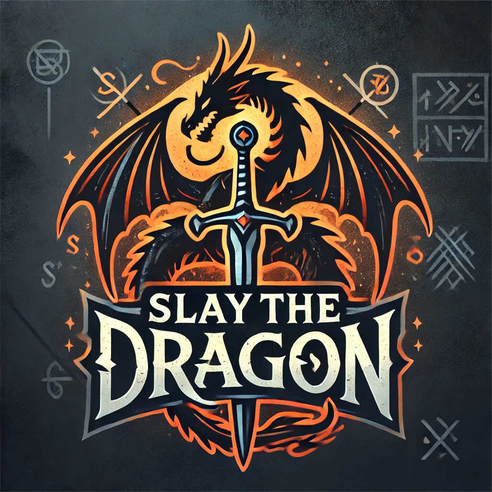
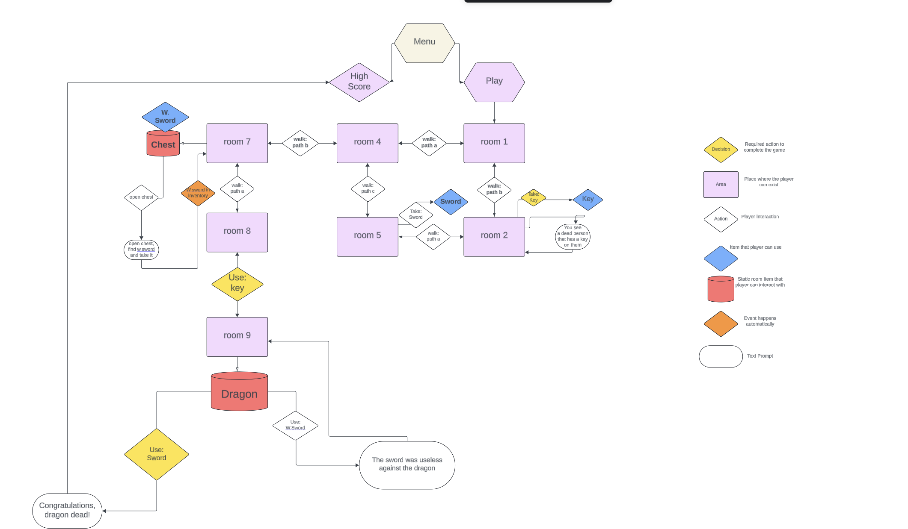

# Slay the Dragon - A Text-Based RPG



## Introduction

**Slay the Dragon** is a classic **text-based adventure game** where players must explore a mysterious dungeon, solve puzzles, and collect items to face the final challenge: **the dragon**. Inspired by classic RPGs like **Zelda**, this game encourages exploration, problem-solving, and strategic thinking.

---

## Gameplay Overview

-   **Navigate through different rooms** using text commands.
-   **Collect key items** to progress and unlock new areas.
-   **Make strategic decisions** that impact the outcome of your journey.
-   **Face a final challenge** that will test all the skills and items you've gathered along the way.

---

## Features

✔ **Multiple rooms to explore** – each with its own unique descriptions and interactions.  
✔ **Item collection** – pick up weapons, keys, and tools to aid in your quest.  
✔ **Dynamic text-based combat and interaction system.**  
✔ **Classic RPG puzzle-solving elements.**  
✔ **Immersive storytelling and an unpredictable journey.**  
✔ **A final battle that rewards preparation and strategy.**

---

## Controls & Commands

Players interact with the game using simple **text-based commands:**

-   `walk [room name]` – Move to a different room.
-   `look_around` – Inspect your surroundings.
-   `go_back` – Go back to the last previous room.
-   `take [item]` – Pick up an item.
-   `use [item]` – Use an item from your inventory.
-   `inventory` – View items you’re carrying.
-   `open [object]` – Interact with static objects (like chests/skeletons).
-   `exit` – Quit the game.

---

## Game Flowchart

Here’s a visual representation of the game’s structure:

_****_

---

## Technologies Used

-   **Python** – Core game logic.
-   **JSON** – Stores game data (rooms, items, interactions).
-   **prompt_toolkit** – Handles user input for a smooth experience.
-   **time** – Handles the timer to see how quick one solves the game.

---

## Installation & Running the Game

1. Clone the repository:
    ```sh
    git clone https://github.com/yourusername/slay-the-dragon.git
    ```
2. Navigate to the project directory:
    ```sh
    cd slay-the-dragon
    ```
3. Install dependencies:
    ```sh
    pip install -r requirements.txt
    ```
4. Run the game:
    ```sh
    python run.py
    ```

---

## Testing & Debugging

-   **Manual playtesting** – Ensured the game works as expected.
-   **Edge case handling** – Checked for invalid inputs and errors.
-   **PEP8 validation** – Confirmed code follows best practices (except a few long lines).

For detailed testing documentation, including **edge cases, error handling, and game-breaking scenarios**, please refer to:

## 📄 **[testing.md](documents/TESTING.md)**

## Deployment

This project was deployed using **Code Institute’s mock terminal** on **Heroku**:

1. Fork or clone this repository.
2. Create a new Heroku app.
3. Set the buildpacks to **Python** and **NodeJS** in that order.
4. Link the Heroku app to this repository.
5. Click **Deploy**.

---

## Future Enhancements

🚀 **Expand the dungeon** with more rooms and challenges.  
🚀 **Add interactive NPCs** that offer hints or side quests.  
🚀 **Introduce enemy AI** for more dynamic combat.

---

## Credits

-   **Game Concept & Development** – Andréas Awenlöf
-   **Inspiration** – Classic RPGs like **Zelda**, **D&D**, and retro text adventures.
-   **Resources & Libraries** – Python, prompt_toolkit, JSON, time.

---

## License

This project is licensed under the **MIT License** – feel free to modify and expand upon it!

---

**_Are you ready to face the unknown and Slay the Dragon?_** ⚔️🔥
